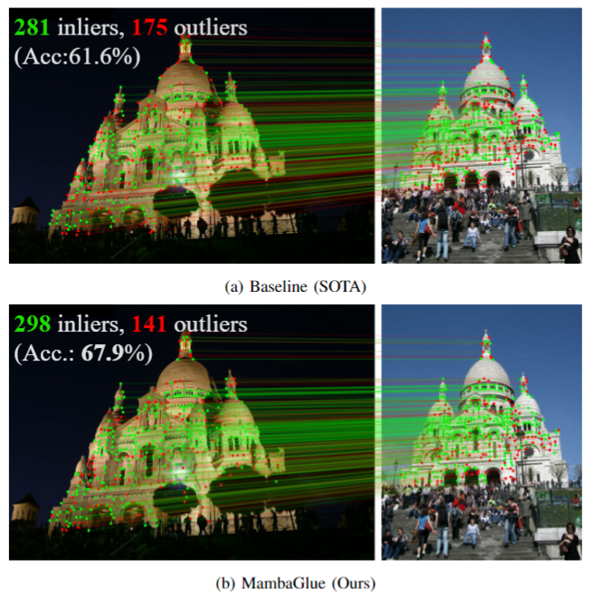

<p align="center">
  <h1 align="center"><a href="https://arxiv.org/abs/2502.00462"><ins>MambaGlue</ins></a> 🐍 @ICRA2025<br>Fast and Robust Local Feature Matching With Mamba</br></h1>
  <p align="center">
    <a href="https://www.linkedin.com/in/kihwan-ryoo-54b68b224/">Kihwan Ryoo</a>
    ·
    <a href="https://scholar.google.com/citations?user=S1A3nbIAAAAJ&hl=ko&oi=ao/">Hyungtae Lim</a>
    ·
    <a href="https://scholar.google.com/citations?user=NrWfJ1gAAAAJ&hl=ko&oi=ao">Hyun Myung</a>
  </p>

</p>
<p align="center">
    </a>
    <br>
    <em>MambaGlue is a hybrid neural network combining the Mamba and the Transformer architectures to match local features.<br></em>
</p>


## MambaGlue :snake:
Main branch includes the standard MambaGlue model.
Thanks to [CVG Lab](https://cvg.ethz.ch/), you can easily train and evaluate the model and visualize the results on [glue-factory branch](https://github.com/url-kaist/MambaGlue/tree/glue-factory) and [hloc branch](https://github.com/url-kaist/MambaGlue/tree/hloc).


## :dart: Training and Evaluation ([glue-factory branch](https://github.com/url-kaist/MambaGlue/tree/glue-factory))
Using [Glue Factory](https://github.com/cvg/glue-factory), set MambaGlue for a matcher model and train MambaGlue with any local features on your own or open-sourced dataset! It will take about 1 week for one trial.
Additionally, you can evaluate its performance compared with other baseline models on benchmarks such as HPatches and MegaDepth.


## :magic_wand: Visualization and Evaluation ([hloc branch](https://github.com/url-kaist/MambaGlue/tree/hloc))
Using [Hierarchical-Localization](https://github.com/cvg/Hierarchical-Localization/), set MambaGlue for a matcher model and run MambaGlue for Structure-from-Motion and visual localization!


## :desktop_computer: Tested Environment
- Linux (UBUNTU 20.04)
- NVIDIA GPU (TITAN V || RTX 3080 || other Ampere architectures)
- CUDA 11.8
- CUDNN 8
- PyTorch 2.1.0
- Python 3.8


## :keyboard: Install
Install MambaGlue:
```bash
git clone https://github.com/state-spaces/mamba && cd mamba
pip install .
cd ..
git clone https://github.com/url-kaist/MambaGlue.git && cd MambaGlue
python -m pip install -e .
```
You can set up the environment starting from [our docker image](https://hub.docker.com/r/rkh137/glue) or [PyTorch official docker image](https://hub.docker.com/layers/pytorch/pytorch/2.1.0-cuda11.8-cudnn8-devel/images/sha256-558b78b9a624969d54af2f13bf03fbad27907dbb6f09973ef4415d6ea24c80d9).


## :clipboard: To Do
- [ ] Release demo code
- [ ] Update branches
- [ ] ONNX

## :memo: Citation
```
@article{ryoo2025mambaglue,
  title={{MambaGlue: Fast and Robust Local Feature Matching With Mamba}},
  author={Ryoo, Kihwan and
          Lim, Hyungtae and
          Myung, Hyun},
  journal={arXiv preprint arXiv:2502.00462},
  year={2025}
}
```

## License
The MambaGlue code provided in this repository is released under the [Apache-2.0 license](./LICENSE).
